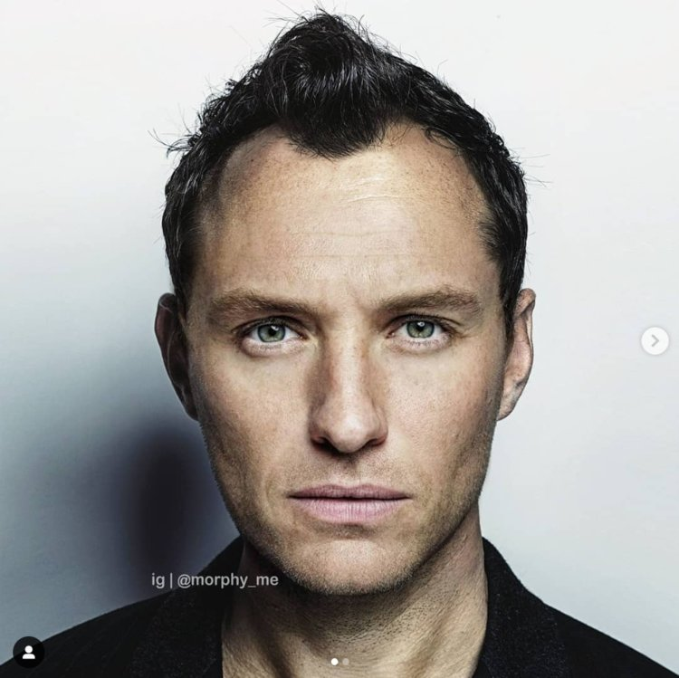

```{r setup, include=FALSE}
options(htmltools.dir.version = FALSE)
knitr::opts_chunk$set(echo = TRUE)
```

## A Quiz.

* 30 questions! 

--

* Musical Rounds + Picture round.

--

* Prize. Amazon gift vouchers. 

--

* No cheating... . 

--

```{r, out.width = "500px", echo=FALSE, fig.align='center'}
 # giphy.com, all sources listed used in cc-by licence.
```

---
## Question 1: General (Psychology) Knowledge.

The British Psychological Society ([BPS](www.bps.org.uk)) is a registered charity and is responsible for the development, promotion and application of psychology for the public good. In which year was it founded, you can be 3 years off.

```{r, out.width = "500px", echo=FALSE, fig.align='center'}
 # giphy.com
```


---
## Question 2: TV.

What is the name of the TV series which follows Cal Lightman, the world's leading deception expert?

```{r, out.width = "250px", echo=FALSE, fig.align='center'}
knitr::include_graphics("https://media.giphy.com/media/9wKSfJXqp2XHG/giphy.gif") # source: giphy
```

---
## Question 3: Clinical Psychology.

Internet gaming disorder was not added to Diagnostic and Statistical Manual of Mental Disorders (DSM) V in 2013 but recommended for further study. Yet, it was recognized by the World Health Organisation.

In which year was it recognised by the WHO? You can be 2 years off.

```{r, out.width = "500px", echo=FALSE, fig.align='center'}
 # source: who.int
```

---
## Question 4: Sport.

Below is a picture of waterpolo (which you can also sign up to at Sport Central, by the way).

How many players are there in a waterpolo **team**? (Note this is not just the players in the water at any time).

```{r, out.width = "400px", echo=FALSE, fig.align='center'}
 # source: gyfcat
```


---
## Question 5: Psycho-analysis (and related)!?

Who is the woman in this picture?

- A) Anna Freud
- B) Mary Ainsworth
- C) Erika Fromm
- D) Melanie Klein
- E) Nancy Chodorow
- F) Julia Kristeva

```{r, out.width = "175px", echo=FALSE, fig.align='center', fig.cap= 'Photo by Douglas Glass'}
knitr::include_graphics("woman2.jpg") # source: https://en.wikipedia.org/wiki/Melanie_Klein#/media/File:Melanie_Klein_1952.jpg, https://wellcomeimages.org/indexplus/image/L0018518.html under CC by 4.0
```

---
## Question 6: History of psychology.

_"A failure is not always a mistake, it may simply be the best one can do under the circumstances. The real mistake is to stop trying"_ Who is credited with this quote?

- A) B.F. Skinner
- B) J.B. Watson
- C) I. Pavlov
- D) E. Thorndike
- E) J. Piaget
- F) L. Vygotsky

```{r, out.width = "350px", echo=FALSE, fig.align='center'}
knitr::include_graphics("https://media.giphy.com/media/1rBCI5HKJPd0k/giphy.gif") # giphy
```

---
## Question 7: Celebrities.

Sometimes it helps to have a famous father or mother. Who is the famous parent of the person in the picture?

```{r, out.width = "400px", echo=FALSE, fig.align='center'}
 
```

---
## Question 8: Geography.

This town pictured below has around 12,000 inhabitants. In 2002, the Scottish Borders tourist board offered to buy it for £8,000.

```{r, out.width = "600px", echo=FALSE, fig.align='center'}
 # from https://www.theguardian.com/money/2017/oct/20/lets-move-to-berwick-upon-tweed-northumberland#img-1 , image by getty images
```

---
## Question 9: Forensic psychology.

Which of the following serial killers, pictured below, dressed up as _"Pogo the clown"_?

- A) Ted Bundy
- B) Jeffrey Dahmer
- C) John Wayne Gacy
- D) Charles Manson
- E) Gary Ridgway
- F) Peter Sutcliffe

```{r, out.width = "425px", echo=FALSE, fig.align='center'}
 # from biography.com fair use.
```

---
## Bonus Bonanza no.1: Mashup.

There are more than 25 (!) songs in this 2017 medley, we are looking for the **titles** of the song, per 5 correct titles we'll give you a point!

Pay close attention!

[Embedding might not work](https://www.youtube.com/watch?v=_OBqr8IJnu0)

<iframe width="1280" height="720" src="https://www.youtube.com/embed/_OBqr8IJnu0" frameborder="0" allow="accelerometer; autoplay; encrypted-media; gyroscope; picture-in-picture" allowfullscreen></iframe>

---
## Question 10: Food and Drink.

Which of the following is considered to be a typical **Belgian** dish? (Why Belgian? Because I am Belgian, that's why... .)

* A) Lobster and fries.
* B) Horse steak, with mash, Brussel sprouts, and gravy.
* C) Bacon and Brussel sprout pie.
* D) Rabbit in a white wine sauce, served with chicory mash.
* E) Steak in chocolate sauce, with fries and vegetables.
* F) Mussels and fries.

```{r, out.width = "450px", echo=FALSE, fig.align='center'}
 # giphy.com
```

---
## Question 11: Relationships... .

What is missing from this title of a published article by Northumbria staff?

Naruse, S., Cornelissen, P.L. and Moss, M. (2018) **‘X’** , couples massage significantly benefits both partners’ wellbeing. _Journal of Health Psychology._

* A) 'To give is better than to receive'
* B) 'It takes two'
* C) 'Different strokes for different folks'
* D) 'Push it real good'
* E) 'Touched by an angel'
* F) 'The Midas touch'

```{r, out.width = "325px", echo=FALSE, fig.align='center'}
 # https://funnyjunk.com/Pc+gamer+relationship/funny-gifs/5429583/
```

---
## Question 12: Sport.

The main central arena of Sport Central also hosted some games by the Newcastle 'X'?

* A) Raptors
* B) Eagles
* C) Ducks
* D) Magpies
* E) Zebras
* F) Vikings

```{r, out.width = "275px", echo=FALSE, fig.align='center'}
knitr::include_graphics("https://media.giphy.com/media/htFUXJH5vjgIw/giphy.gif") # giphy
```

---
## Question (unlucky) 13: Statistics.

The _t_-test, a commonly used statistical test, was developed by an employee from a certain company (in this picture). Which company did the employee work for?

* A) Barclays 
* B) Guinness Brewery
* C) IBM (International Business Machines)
* D) BP (British Petrol)
* E) Rothamsted research
* F) Great Western Railway.


```{r, out.width = "175px", echo=FALSE, fig.align='center'}
 #  public, from https://en.wikipedia.org/wiki/William_Sealy_Gosset#/media/File:William_Sealy_Gosset.jpg
```

---
## Question 14: Fruit and Veg.

Another title of a paper where you have to fill in the blanks:

Haskell-Ramsay, C.F., Stuart, R.C., Okello, E.J., Watson, A.W. (2017). Cognitive and mood improvements following acute supplementation with XX juice in healthy young adults. _European Journal of Nutrition_, 56(8):2621-2631.

Which fruit or vegetable is missing?

* A) Prune
* B) Tomato
* C) Lemon
* D) Grape
* E) Cucumber
* F) Melon


```{r, out.width = "150px", echo=FALSE, fig.align='center'}
knitr::include_graphics("https://media.giphy.com/media/IBd4FBqsP2hWg/giphy.gif") # from giphy fair use.
```

---
## Question 15: Cinema.

The Imitation Game is a 2014 film portraying the life of Alan Turing, who is credited to be the founding father of modern computing and is believed to have had Asperger's Syndrome. Who portrayed Alan Turing in the movie?

* A) Nicholas Hoult
* B) Benedict Cumberbatch
* C) James McAvoy
* D) Colin Firth
* E) Ian McKellen
* F) Eddie Redmayne

```{r, out.width = "350px", echo=FALSE, fig.align='center'}
knitr::include_graphics("https://media.giphy.com/media/IPuswjolNFQze/giphy.gif") # source: giphy - fair use.
```

---
## Question 16: Brains, Brains, Brains (Neuropsychology).

Which brain structure is literally translated as 'sea horse' in Latin?

```{r, out.width = "500px", echo=FALSE, fig.align='center'}
 # source: https://www.google.co.uk/url?sa=i&rct=j&q=&esrc=s&source=images&cd=&ved=2ahUKEwij1JmdvL3dAhUHhxoKHUf_CN4Qjxx6BAgBEAI&url=https%3A%2F%2Farchive.4plebs.org%2Ftg%2Fthread%2F61359195%2F&psig=AOvVaw0204uV-8fwzsrZbfxZC5AN&ust=1537116609993970 
```

---
## Question 17: Celebrity and Lifestyle.

Which former Northumbria graduate is portrayed in the picture below?

```{r, out.width = "550px", echo=FALSE, fig.align='center'}
 # source:https://www.theguardian.com/tv-and-radio/2018/jun/21/sophie-gradon-love-island-contestant-dies-aged-32#img-1
```

---
## Question 18: Literature.

Which author wrote the book: _'Normal people'_ ? It is the winner of the Costa Novel Award?

```{r, out.width = "550px", echo=FALSE, fig.align='center'}
 # source: https://www.pinterest.com/pin/567594359258311612/
```

---
## Question 19: Food and Drink.

When was Newcastle Brown ale first launched, you can be 3 years off?

```{r, out.width = "400px", echo=FALSE, fig.align='center'}
 # source: https://picclick.co.uk/Mens-NEWCASTLE-BROWN-ALE-Printed-T-Shirt-Scottish-371149950458.html
```

---
## Question 20: Animals.

The 'mirror test', also sometimes referred to as mark test, has been argued to be a test of visual self-recognition. 

In 2015, a study found evidence that 3 species were able to pass the test: _Myrmica sabuleti, Myrmica rubra, and Myrmica ruginodis_. They are species of what animal? 

```{r, out.width = "500px", echo=FALSE, fig.align='center'}
knitr::include_graphics("https://media.giphy.com/media/noqUFXGNuZDLG/giphy.gif") # source: giphy
```

---
## Question 21: Music.

Which 2 members of Little Mix are (reported to be) from South Shields? (0.5 point each)

```{r, out.width = "500px", echo=FALSE, fig.align='center'}
knitr::include_graphics("https://media.giphy.com/media/3oKIPDJHworCpAPGIE/giphy.gif") # source: giphy.com
```

---
## Question 22: Clinical psychology.

What is linonophobia?

```{r, out.width = "580px", echo=FALSE, fig.align='center'}
knitr::include_graphics("yoda_fear.gif") # source: giphy.com
```

---
## Question 23: Monkey business... .

Let's watch this video and count the number of passes.

[embedding might not work](https://www.youtube.com/embed/IGQmdoK_ZfY)

--

How many team players were there in the black team?

- A) 3 or 4, started with 3 but one joined.
- B) 3, a constant team size of 3.
- C) 2 or 3, started with 2 but one additional player joined.
- D) 3, but made up of 6 different players
- E) 2 or 3, started with 3 but one left. 
- F) 3, but made up of 4 different players


---
## Bonus Bonanza no.2 : Theme tune round.

There are 25 TV theme tunes. 

For each 5 correct, we'll award you a point! Pay close attention!

[embedding might not work](https://www.youtube.com/embed/zeAPo5A-VvM)

<iframe width="1243" height="932" src="https://www.youtube.com/embed/zeAPo5A-VvM" frameborder="0" allow="accelerometer; autoplay; encrypted-media; gyroscope; picture-in-picture" allowfullscreen></iframe>

---
## Question 24: Mashup, the different kind.

Which 4 celebrities are in the morphed images below? (You can get 0.5 point if you have 2 correct)

.pull-left[
```{r, out.width = "450px", echo=FALSE, fig.align='left'}
 # source: @morphy_me, https://www.insider.com/artist-morphs-celebrity-faces-together-to-create-perfect-hybrids-2019-4#beyonc-and-margot-robbie-19
```
]

.pull-right[
```{r, out.width = "450px", echo=FALSE, fig.align='left'}
 # source: @morphy_me, https://www.insider.com/artist-morphs-celebrity-faces-together-to-create-perfect-hybrids-2019-4#beyonc-and-margot-robbie-19
```
]

---
## Question 25: IT and related problems.

What is the extension you have to dial to reach the Northumbria IT helpline (on a phone at campus). 4 digits needed.

```{r, out.width = "450px", echo=FALSE, fig.align='center'}
knitr::include_graphics("https://media.giphy.com/media/cpY0YQRx9KfXW/giphy.gif") # source: giphy
```

---
## Question 26: Internationalisation.

We recently had 2 new members of staff join, next to a whole other group actually, **Julius Jooste** and **Jason Rasjic** where were they born?

So you would need 2 countries. (You can get 0.5 point, if you get one right)


```{r, out.width = "450px", echo=FALSE, fig.align='center'}
knitr::include_graphics("https://media.giphy.com/media/3o6Zt1kFZVR1s8r6gw/giphy.gif") # source: giphy
```

---
## Question 27: Mental health.

This charity offers emotional support to anyone in emotional distress, struggling to cope or at risk of suicide. Their number is 116-123.

Which charity are we looking for?

```{r, out.width = "275px", echo=FALSE, fig.align='center'}
knitr::include_graphics("https://media.giphy.com/media/ZKYO2Kl6ymmYM/giphy.gif") # fair use from giphy.com
```

---
## Question 28: Celebrity (studies...).

There is a journal called '[Celebrity Studies](https://www.tandfonline.com/action/journalInformation?show=aimsScope&journalCode=rcel20)'. They have the following forthcoming article entitled:  _**X** and ‘Malibu’: a discourse analysis_.

Who is 'X'?

* A) David Hasselhoff
* B) Britney spears
* C) Paris Hilton 
* D) Angelina Jolie
* E) Pamela Anderson
* F) Miley Cyrus

```{r, out.width = "275px", echo=FALSE, fig.align='center'}
knitr::include_graphics("https://media.giphy.com/media/3o7qDY52fIVTVbXoM8/giphy.gif") # source: giphy.com
```

---
## Question 29: Technology!

EEG is a common way in which we can 'measure' brain activity via use of electrodes. What is the maximum number of electrodes a state of the art EEG system has (in our example, the 'eego mylab' is the reference).

* A) 10  
* B) 24
* C) 32
* D) 64
* E) 256
* F) 512

```{r, out.width = "400px", echo=FALSE, fig.align='center'}
 # source: giphy.com
```


---
## Question 30: Psychology students...

Which of the following celebrities did **not** pursue a Psychology course?

* A) Lil Wayne
* B) Nathalie Portman
* C) Mark Zuckerberg
* D) Lisa Kudrow ("Phoebe from friends")
* E) Rowan Atkinson ("Mr.Bean")
* F) Jessica Ennis-Hill 

```{r, out.width = "400px", echo=FALSE, fig.align='center'}
knitr::include_graphics("https://media.giphy.com/media/XUhDLCXFGdFew/giphy.gif") # source: Giphy.
```

---
## Tiebreaker.

The river Tyne has how many breeding pairs of kittiwakes? (Estimate according to the Natural History Society of Northumbria) 

```{r, out.width = "500px", echo=FALSE, fig.align='center'}
 # https://stadsvogels.wordpress.com/tag/kittiwake/
```


---
## The end

```{r, out.width = "750px", echo=FALSE, fig.align='center'}
knitr::include_graphics("Quiz-over.jpg") # https://stadsvogels.wordpress.com/tag/kittiwake/
```

