```{r setup, include=FALSE}
options(htmltools.dir.version = FALSE)
knitr::opts_chunk$set(echo = TRUE)
```

## A Quiz.

* 30 questions! 

--

* Musical Rounds + Picture round.

--

* Prize.

--

* No cheating... . 

--

```{r, out.width = "500px", echo=FALSE, fig.align='center'}
knitr::include_graphics("interesting.gif") # giphy.com, all sources listed used in cc-by licence.
```

---
## Question 1: General (Psychology) Knowledge.

According to the British Psychological Society (BPS), how many out of 100,000 people are registered psychologists in the UK (Data from 2016)?

X out of 100,000


```{r, out.width = "500px", echo=FALSE, fig.align='center'}
knitr::include_graphics("psychology.gif") # giphy.com
```


---
## Question 2: TV.

What is the first name of character played by the actress Kirsten Vangsness in the show 'Criminal Minds'?

```{r, out.width = "500px", echo=FALSE, fig.align='center'}
 # source: buzzfeed
```

---
## Question 3: Clinical Psychology.

The 'diagnosis of homosexuality' used to be classified as a psychiatric disorder in the Diagnostic and Statistical Manual of Mental Disorders (DSM) by the American Psychiatric Association. 

In which year was it removed?

```{r, out.width = "400px", echo=FALSE, fig.align='center'}
 # source: alltrials.net
```

---
## Question 4: Sport.

Below is a picture of Korfball (which you can also play at Sport Central, by the way)

How many players are there in a Korfball team?

```{r, out.width = "400px", echo=FALSE, fig.align='center'}
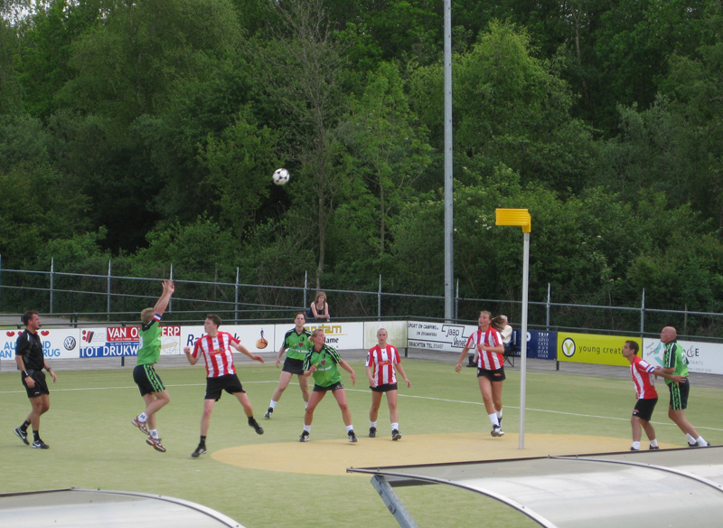 # source: wikipedia
```


---
## Question 5: Psycho-analysis (and related)!?

Who is the woman in this picture?

- A) Anna Freud
- B) Mary Ainsworth
- C) Erika Fromm
- D) Melanie Klein
- E) Nancy Chodorow
- F) Julia Kristeva

```{r, out.width = "250px", echo=FALSE, fig.align='center'}
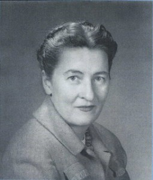 # source: feministvoices.com/mary-ainsworth
```

---
## Question 6: History of psychology.

As part of a wartime project, 'project pigeon', B.F. Skinner trained pigeons to continuously peck at an image via training. How many pecks did he achieve within a 45 mins. window with a pigeon?

- A) 180
- B) 360
- C) 750
- D) 2,500
- E) 10,000
- F) 15,000

```{r, out.width = "350px", echo=FALSE, fig.align='center'}
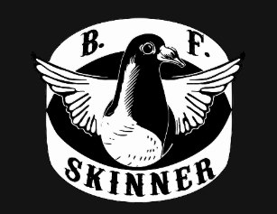 # zazzle.com
```

---
## Question 7: Numerology.

When is my birthday? It is also when we are hosting the BPS career event held here at Northumbria. Hint: I am a scorpio.

```{r, out.width = "400px", echo=FALSE, fig.align='center'}
knitr::include_graphics("https://media.giphy.com/media/GXnaqmGcg1CTu/giphy.gif") 
```

---
## Question 8: Geography.

What is the name of the highest peak in Northumberland at 2,676 ft (816m) ?

```{r, out.width = "400px", echo=FALSE, fig.align='center'}
 
```

---
## Question 9: Forensic psychology.

Which of the following serial killers pursued psychology as a major?

- A) Ted Bundy
- B) Jeffrey Dahmer
- C) John Wayne Gacy
- D) Charles Manson
- E) Gary Ridgway
- F) Peter Sutcliffe

```{r, out.width = "375px", echo=FALSE, fig.align='center'}
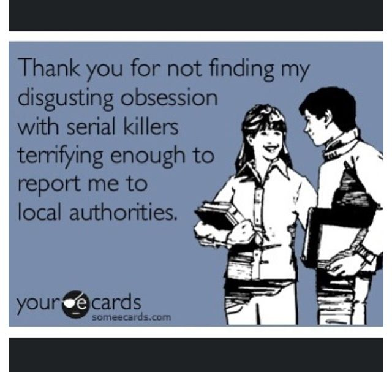 
```

---
## Bonus Bonanza no.1: Mashup.

There are more than 25 (!) songs in this medley, we are looking for the *artists*, per 5 correct artists we'll give you a point!

Pay close attention!

[Embedding might not work](https://www.youtube.com/watch?v=qOCIBn8TP2s&feature=youtu.be)

<iframe width="560" height="315" src="https://www.youtube.com/embed/qOCIBn8TP2s?rel=0" frameborder="0" allow="autoplay; encrypted-media" allowfullscreen></iframe>

---
## Question 10: Food and Drink.

Which of the following is a scientific journal _"specializing in cultural, social, psychological, sensory and physiological influences on the selection and intake of foods and drinks."_

* A) Hunger & Thirst
* B) Satiation
* C) Appetite
* D) Gluttony
* E) Foodies
* F) Gut

```{r, out.width = "400px", echo=FALSE, fig.align='center'}
knitr::include_graphics("yumm.gif") # giphy.com
```

---
## Question 11: Relationships... .

Which 2 words are missing from this title of a recently published article by Northumbria staff?

Naruse, S., Cornelissen, P.L. and Moss, M. (2018) ‘To give is better than to receive?’ *X* *Y* significantly benefits both partners’ wellbeing. _Journal of Health Psychology._

```{r, out.width = "400px", echo=FALSE, fig.align='center'}
knitr::include_graphics("relationships.gif") # https://funnyjunk.com/Pc+gamer+relationship/funny-gifs/5429583/
```

---
## Question 12: Sport.

What is the seating capacity of the main central arena of Sport Central, which also hosts games by the Newcastle Eagles (Basketball)?

* A) 1000
* B) 2500
* C) 3000
* D) 3750
* E) 4200
* F) 4500

```{r, out.width = "400px", echo=FALSE, fig.align='center'}
 # https://www.buzzfeed.com/ktlincoln/the-25-best-sports-gifs-in-the-history-of-sports
```

---
## Question (unlucky) 13: Statistics.

Who developed this 'machine', a quincunx? Basically it is a vertical board with rows of pegs. From the top beads are dropped, and when the device is level, they bounce either left or right as they hit the pegs. This was used to illustrate the normal distribution. So, we need the name of the inventor.

```{r, out.width = "600px", echo=FALSE, fig.align='center'}
knitr::include_graphics("Quincunx.gif") # Quincunx from https://makeagif.com/gif/galtonboard-galtonbrett-simulation-or-bean-machine-or-quincunx-or-galton-box-ocFzv4
```

---
## Question 14: Colours.

Another title of  a paper where you have to fill in the blanks (one word):

Haskell-Ramsay, C.F., Stuart, R.C., Okello, E.J., Watson, A.W. (2017). Cognitive and mood improvements following acute supplementation with *WHICH COLOUR* grape juice in healthy young adults. _European Journal of Nutrition_, 56(8):2621-2631.

```{r, out.width = "240px", echo=FALSE, fig.align='center'}
 # https://www.pinterest.com/pin/292593307016044366/
```

---
## Question 15: Cinema.

The imitation game is a film starring Benedict Cumberbatch. It portrays the life of someone who is believed to have had Asperger's Syndrome. Whose life does it portray?

```{r, out.width = "600px", echo=FALSE, fig.align='center'}
 # source: https://www.pinterest.com/pin/482377810065247611/
```

---
## Question 16: Brains, Brains, Brains (Neuropsychology).

Which brain structure is translates literally translated as 'little brain' in Latin?

```{r, out.width = "500px", echo=FALSE, fig.align='center'}
knitr::include_graphics("brain.gif") # source: https://www.google.co.uk/url?sa=i&rct=j&q=&esrc=s&source=images&cd=&ved=2ahUKEwij1JmdvL3dAhUHhxoKHUf_CN4Qjxx6BAgBEAI&url=https%3A%2F%2Farchive.4plebs.org%2Ftg%2Fthread%2F61359195%2F&psig=AOvVaw0204uV-8fwzsrZbfxZC5AN&ust=1537116609993970 
```

---
## Question 17: Celebrity and Lifestyle.

Which Newcastle born star was Boots group 'bonniest baby', Metrocentre's 'most attractive girl', and featured in an advert for British Gas?

```{r, out.width = "500px", echo=FALSE, fig.align='center'}
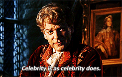 # source: https://imorca.tumblr.com/gif
```

---
## Question 18: Literature.

Which author wrote the book: _'The Shaking Woman or a History of My Nerves'_ and is married to the novelist Paul Auster?

```{r, out.width = "500px", echo=FALSE, fig.align='center'}
knitr::include_graphics("black_books.gif") # source: https://www.pinterest.com/pin/567594359258311612/
```

---
## Question 19: Food and Drink.

How many calories are there in a bottle of Newcastle Brown ale (550 ml) (you are allowed to be 10 calories off the mark)?

```{r, out.width = "400px", echo=FALSE, fig.align='center'}
knitr::include_graphics("newcastle_brown.jpg") # source: https://picclick.co.uk/Mens-NEWCASTLE-BROWN-ALE-Printed-T-Shirt-Scottish-371149950458.html
```

---
## Question 20: Animals.

Sigmund Freud received 2 dogs in his mid-70s, one of them named 'Jofi'. Which breed of dogs were they?

```{r, out.width = "500px", echo=FALSE, fig.align='center'}
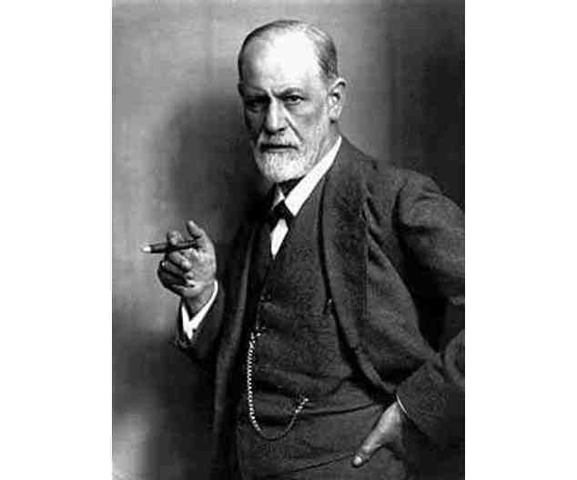 # source: https://gfycat.com/gifs/detail/jovialhandyalaskajingle
```

---
## Question 21: Music.

Which alternative rock music band was formed in 2000 in Newcastle upon Tyne, and consists of Paul Smith, Duncan Lloyd, Lukas Wooller and Tom English?

```{r, out.width = "500px", echo=FALSE, fig.align='center'}
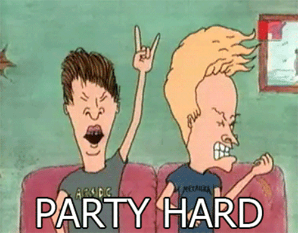 # source: giphy.com
```

---
## Question 22: Clinical psychology.

What is trypophobia?

```{r, out.width = "580px", echo=FALSE, fig.align='center'}
knitr::include_graphics("yoda_fear.gif") # source: giphy.com
```

---
## Question 23: Film.

'The Experimenter' is a 2015 movie starring Winona Ryder and Peter Sarsgaard. It portrays the life of which psychologist?

```{r, out.width = "600px", echo=FALSE, fig.align='center'}
 # source: rogerebert.com
```

---
##Bonus Bonanza no.2 : Theme tune Mashup

There are up to 20 (!) American TV theme tunes in this mash-up. One of them appears twice. 

For each 5 correct, we'll award you a point! Pay close attention!

<iframe width="100%" height="400" src="https://www.youtube.com/embed/hWDiM8Us_y8" frameborder="0" allow="autoplay; encrypted-media" allowfullscreen></iframe>


---
## Question 24: Mashup, the different kind.

Which 2 celebrities are in the morphed image below?

```{r, out.width = "310px", echo=FALSE, fig.align='center'}
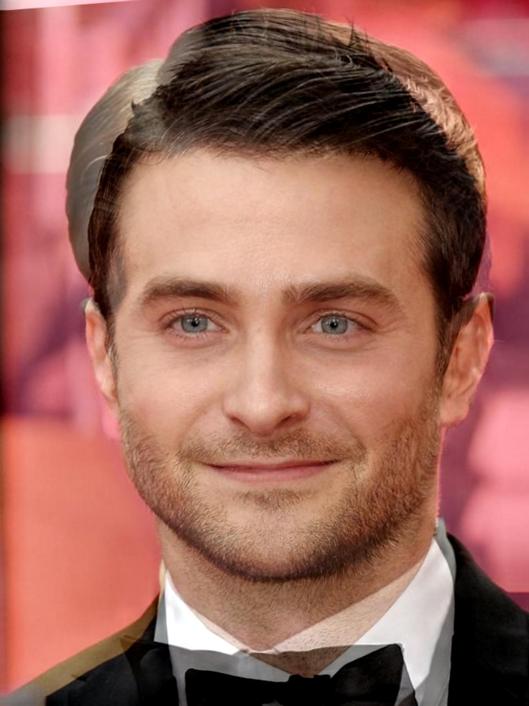 # source: Amazing Amy newman
```

---
## Question 25: The future, well your future.

Career support can help you with finding a job. They offer Careers Information and Job Search Drop-in sessions, every day from Monday to Friday during teaching weeks, but at what times?

Between _x_ and _y_ pm.

```{r, out.width = "450px", echo=FALSE, fig.align='center'}
 # source: Amazing Amy newman
```

---
## Question 26: Internationalisation.

Which ***2*** words are missing from the following conference presentation led by French Ph.D. student Léa Martinon (who also teaches on our programme). I cannot stress enough that she is French... .

Martinon, L. M., Smallwood, J., Hamilton, C., & Riby, L. M. (2017, June). **X** **Y** versus roast beef: How culture can impact our mind-wandering experiences across the life span. Paper presented at _Journées de Printemps de la Société de Neuropsychologie de langue Française, Anosognosie et Etats de Conscience_, Grenoble, France.

```{r, out.width = "250px", echo=FALSE, fig.align='center'}
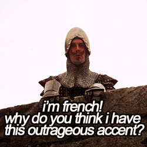 # source: tumblr.com
```

---
## Question 27: Mental health.

The Samaritans are a charity offering emotional support to anyone in emotional distress, struggling to cope or at risk of suicide. Complete the free to call number you can reach them on (3 digits).

116-*XYZ*

```{r, out.width = "275px", echo=FALSE, fig.align='center'}
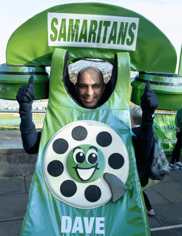 # source: samaritans.org
```

---
## Question 28: Celebrity lifestyle / Fashion.

This celebrity has over 12 million followers on YouTube and regularly vlogs about fashion, beauty and lifestyle. In 2012, she bravely opened up about her own experiences with mental health. She is also the digital ambassador for the charity 'Mind'. Who is she?

```{r, out.width = "500px", echo=FALSE, fig.align='center'}
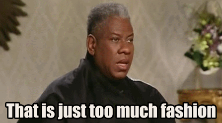 # source: hausofvolta.com
```

---
## Question 29: Technology!

At the psychology and communication technology (PaCT) Lab they conduct research focussing on human - computer interactions. Which word is missing from the following paper title of a recently published paper?

McNeill, A. and Sillence, E. (2018). Motivations and stake management in producing YouTube “bro-science” videos for **X** treatment. _International Journal of Web Based Communities, 14 (2)_, 97-113. 

```{r, out.width = "400px", echo=FALSE, fig.align='center'}
knitr::include_graphics("technology.gif") # source: giphy.com
```


---
## Question 30: Mashup, The Revenge.

Which 2 celebrities are in the morphed image below?

```{r, out.width = "300px", echo=FALSE, fig.align='center'}
 # source: Amazing Amy newman
```

---
## Tiebreaker.

The river Tyne has how many breeding pairs of kittiwakes? (Estimate according to the Natural History Society of Northumbria) 

```{r, out.width = "500px", echo=FALSE, fig.align='center'}
knitr::include_graphics("kittiwakes.jpg") # https://stadsvogels.wordpress.com/tag/kittiwake/
```


---
## The end

```{r, out.width = "600px", echo=FALSE, fig.align='center'}
knitr::include_graphics("Quiz-over.jpg") # https://stadsvogels.wordpress.com/tag/kittiwake/
```

